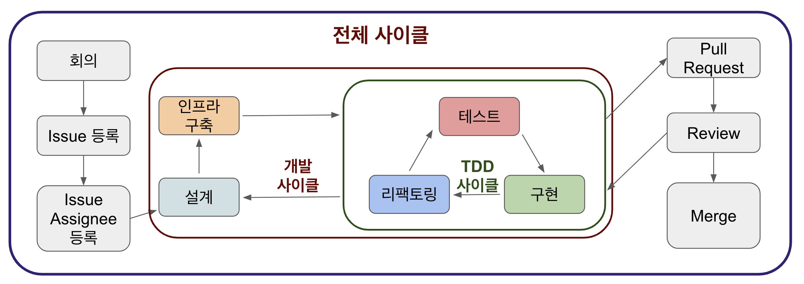

# Warming Up Team4 Server 

[](https://travis-ci.org/depromeet/warming-up-team4-server)

## 환경
* 언어
    * Java (JDK 12)
* 빌드툴
    * Gradle (5.6)
* 웹 프레임워크
    * Spring Boot (2.2.x)
    * [gRPC](https://github.com/depromeet/warming-up-team4-server/wiki/gRPC%EB%9E%80%3F)
* 데이터베이스
    * MySQL (8.0) - Production 
    * H2 - Local, Test, Develop
    * Redis (5.0)
* 테스트
    * JUnit 5
* 문서화
    * [Protocol Buffers](https://github.com/depromeet/warming-up-team4-server/wiki/Protocol-Buffers%EB%9E%80%3F) DSL로 대체

## 폴더 구조
* DDD 기반의 폴더 구조를 가졌습니다.
    * 일반적인 계층(Layered Architecture) 구조와는 조금 다른데, 스프링에서 사용하기 편하게 조금 변형하여 사용합니다.
```
.
+-- config                                  // 설정 파일
+-- domain                                  // 도메인 로직
    +-- account                             // 계정 관련 로직
    +-- authentication                      // 인증 정보 관련
    +-- barter                              // 물물교환 관련
    +-- chat                                // 채팅 관련
    +-- health                              // 서버 헬스 체크 
    +-- item                                // 물물교환 대상 물건들
    +-- notification                        // 알람 관련
    +-- system                              // 시스템 관련 (인증 없음)
    +-- university                          // 대학교 관련 (이메일) 
    +-- user                                // 유저 정보 관련
+-- global                                  // 도메인에서 공용으로 쓰이는 것들
    +-- entity                              // DB Entity 정보
    +-- exception                           // 예외처리 정보
    +-- interceptor                         // 인터셉터
    +-- security                            // 인증 관련
        +-- jwt                             // JWT 토큰 관련
+-- properties                              // 설정파일들
+-- utils                                   // 유틸리티
+-- Application                             // 메인 클래스
+-- TemporaryDataInjector                   // 서버 부팅 시 임시 데이터 추가 
```

## 전체적인 로직 설명
* 계정
    * 회원가입을 할 수 있다.
        * 회원가입 시 서버에 등록된 이메일 도메인만 회원가입 가능하다.
    * 로그인을 할 수 있다.
        * 로그인 시 JWT 토큰을 발행한다.
* 물건
    * 물건을 등록할 수 있다.
    * 물건을 조회할 수 있다.
    * 물건 피드를 받아볼 수 있다.
* 물물교환
    * 물건에 대해 물물교환 요청할 수 있다.
    * 물건에 대해 물물교환 요청을 받을 수 있다.
    * 서로 물물교환에 대해 승인한다면 거래를 진행할 수 있다.
* 채팅
    * 서로 물물교환 승인 시 채팅을 할 수 있다.
* 알람
    * 물물교환 요청이 올 경우 알람을 받아볼 수 있다.

## 개발 방법

### 개발 사이클


#### [Issue 목록](https://github.com/depromeet/warming-up-team4-server/issues?q=is%3Aissue+is%3Aopen+sort%3Aupdated-desc)

#### [Pull Request 목록](https://github.com/depromeet/warming-up-team4-server/pulls?q=is%3Apr+is%3Aopen+sort%3Aupdated-desc)

---

## 참고 자료

### proto 가져오는 방법 (Submodule)
```shell script
git submodule init && git submodule update
```

### Java Style Guide
* https://google.github.io/styleguide/javaguide.html

### gRPC Style Guide
* https://developers.google.com/protocol-buffers/docs/style

## Reference
* [gRPC](https://grpc.io/)
* [Protocol Buffers](https://developers.google.com/protocol-buffers)